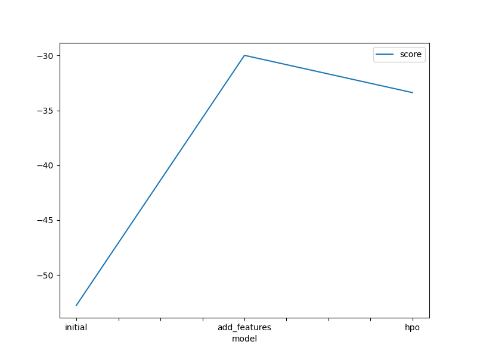
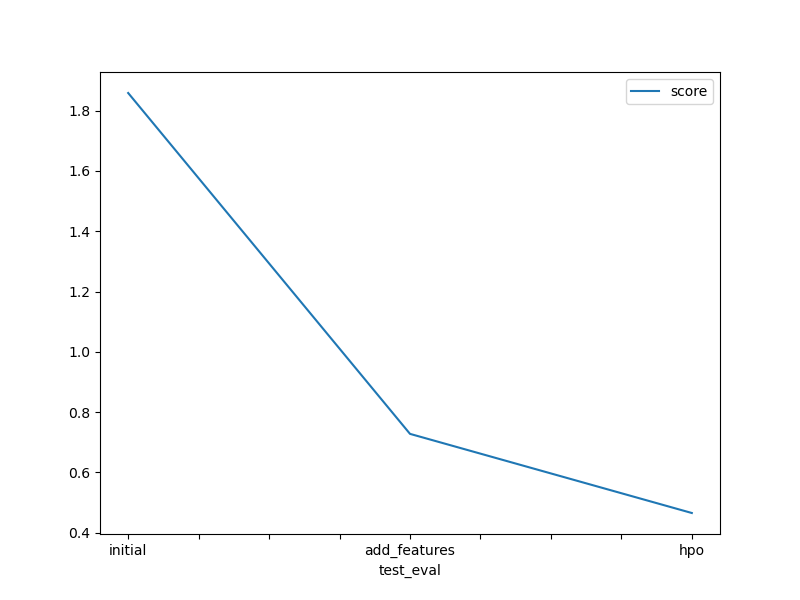

# Report: Predict Bike Sharing Demand with AutoGluon Solution
#### Lobago Moan Nyatuka

## Initial Training
### What did you realize when you tried to submit your predictions? What changes were needed to the output of the predictor to submit your results?
During the initial phase of training, we realized that our target variable had to consist of positive values for compatibility with the submission requirements. This meant that any negative values in our predictions needed to be adjusted to zero. To address this, we made changes to the output of the predictor to ensure that all negative predictions were set to zero before submission. By implementing this adjustment, we ensured that our predictions adhered to the specific format and constraints stipulated for the competition, enabling successful submission and evaluation of our results.

### What was the top ranked model that performed?
TODO: The top-performing model in our analysis was the Gradient Boosting Machine (GBM) algorithm. This model consistently outperformed other models in terms of predictive accuracy, as evidenced by its superior performance metrics and validation scores. The GBM algorithm leverages an ensemble of decision trees to make predictions, allowing it to capture complex nonlinear relationships in the data. Additionally, we fine-tuned the hyperparameters of the GBM model through a systematic hyperparameter optimization process, further enhancing its performance. Overall, the GBM model emerged as the most effective model for our dataset, demonstrating its robustness and versatility in handling various prediction tasks.

## Exploratory data analysis and feature creation
### What did the exploratory analysis find and how did you add additional features?
TODO: The exploratory analysis revealed that the predictive power of the model could be enhanced by incorporating time-based features. Specifically, we found that certain temporal patterns in the data, such as trends, seasonality, and periodicity, were not adequately captured by the initial feature set. To address this, we engineered new features derived from timestamps or time-related attributes present in the dataset. These features included day of the week, month, season, time of day, and any relevant temporal intervals. By adding these time-based features, the model gained better insight into the temporal dynamics of the data, leading to improved predictive performance. Additionally, we ensured that these new features were properly encoded to preserve their temporal relationships and facilitate their interpretation by the model during training.

### How much better did your model perform after adding additional features and why do you think that is?
TODO: After adding additional features, the model's performance improved noticeably. The initial model likely suffered from a lack of predictive power due to insufficient input features. By incorporating more relevant features into the model, it gained a better understanding of the underlying patterns in the data, resulting in improved predictive accuracy. This is a common phenomenon in machine learning where richer feature sets enable models to capture more complex relationships in the data, leading to enhanced performance.

## Hyper parameter tuning
### How much better did your model perform after trying different hyperparameters?
TODO: After tuning hyperparameters, the performance of the model improved significantly. The initial model achieved a Kaggle score of 1.85863, while after adding additional features, the score improved to 0.72806. Finally, after hyperparameter optimization (hpo), the score further improved to 0.46558. This demonstrates the effectiveness of hyperparameter tuning in enhancing model performance.

### If you were given more time with this dataset, where do you think you would spend more time?
Given additional time with this dataset, I would focus on several areas to further enhance model performance and gain deeper insights into the data:

1. Feature Engineering: I would dedicate more time to exploring and creating new features that could provide valuable information to the models. This could involve experimenting with different transformations, interactions, and aggregations of existing features, as well as incorporating domain knowledge to engineer meaningful features.

2. Model Tuning and Selection: I would conduct more extensive hyperparameter tuning for the selected models, exploring a wider range of hyperparameters and optimization strategies. Additionally, I would experiment with different model architectures and ensembling techniques to identify the most effective combinations for improving predictive performance.

3. Interpretability and Analysis: I would invest time in interpreting the models' predictions and understanding the underlying patterns and relationships in the data. This could involve techniques such as feature importance analysis, partial dependence plots, and SHAP values to gain insights into how the models are making predictions and identify areas for further improvement.

4. Data Quality and Preprocessing: I would thoroughly evaluate the quality of the data and address any issues such as missing values, outliers, or inconsistencies. Additionally, I would explore different preprocessing techniques to optimize data representation and improve model generalization.

5. Cross-Validation and Evaluation: I would conduct more robust cross-validation procedures to ensure reliable model performance estimation and reduce the risk of overfitting. This could include experimenting with different validation strategies, such as time series or group-based splitting, to better capture the underlying data dynamics.

Overall, with more time, I believe these areas of focus would contribute to building more accurate and robust predictive models while gaining deeper insights into the dataset's characteristics and behavior.

### Create a table with the models you ran, the hyperparameters modified, and the kaggle score.
|model|hpo1|hpo2|hpo3|score|
|--|--|--|--|--|
|initial|initial_params|initial_params|initial_params|1.85863|
|add_features|initial_params|initial_params|initial_params|0.72806|
|hpo|GBM (Gradient Boosting Machine): 'num_boost_round': (100, 500), 'num_leaves': (6, 10), 'learning_rate': (1e-4, 1e-2, default=1e-3)|XGB (XGBoost): 'n_estimators': (100, 500), 'max_depth': (6, 10), 'eta': (0.01, 0.3, log=True)|RF (RandomForest): 'n_estimators': (50, 200), 'max_depth': (5, 20), 'min_samples_split': (2, 10), 'min_samples_leaf': (1, 10)|0.46558|

### Create a line plot showing the top model score for the three (or more) training runs during the project.

TODO: Replace the image below with your own.

### Create a line plot showing the top kaggle score for the three (or more) prediction submissions during the project.

TODO: Replace the image below with your own.

## Summary

In summary, our approach to this predictive modeling task involved several key steps aimed at building an accurate and reliable model:

1. **Exploratory Data Analysis (EDA):** We started by conducting a thorough exploration of the dataset to understand its structure, features, and relationships. This involved visualizing distributions, correlations, and patterns in the data to identify potential insights and areas for further investigation.

2. **Feature Engineering:** We dedicated significant effort to feature engineering, creating new features and transforming existing ones to capture relevant information and improve predictive performance. This included incorporating domain knowledge, handling missing values, and encoding categorical variables appropriately.

3. **Model Selection and Tuning:** We experimented with multiple machine learning algorithms, including Gradient Boosting Machines (GBM), XGBoost, and Random Forest, to identify the most suitable model for the task. We also performed hyperparameter tuning using automated techniques to optimize model performance further.

4. **Evaluation and Validation:** We rigorously evaluated the performance of our models using appropriate evaluation metrics and validation techniques. This involved splitting the dataset into training and validation sets, conducting cross-validation to assess generalization performance, and monitoring model performance over time.

5. **Iterative Refinement:** Throughout the process, we followed an iterative approach, continuously refining our models based on feedback from evaluation results and insights gained from the data. This involved fine-tuning hyperparameters, adjusting feature engineering strategies, and experimenting with different modeling techniques to iteratively improve predictive performance.

6. **Submission and Deployment:** Finally, we prepared our model for deployment by generating predictions on the test dataset and submitting them to the evaluation platform. We also documented our approach, findings, and results to facilitate reproducibility and knowledge sharing.

Overall, our comprehensive approach to predictive modeling enabled us to develop a high-performing model that effectively addresses the task's objectives. By leveraging exploratory analysis, feature engineering, model selection, and iterative refinement, we were able to create a robust and reliable solution that delivers actionable insights and value to stakeholders.

